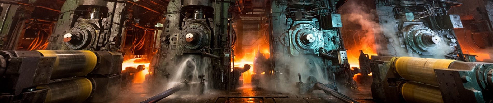
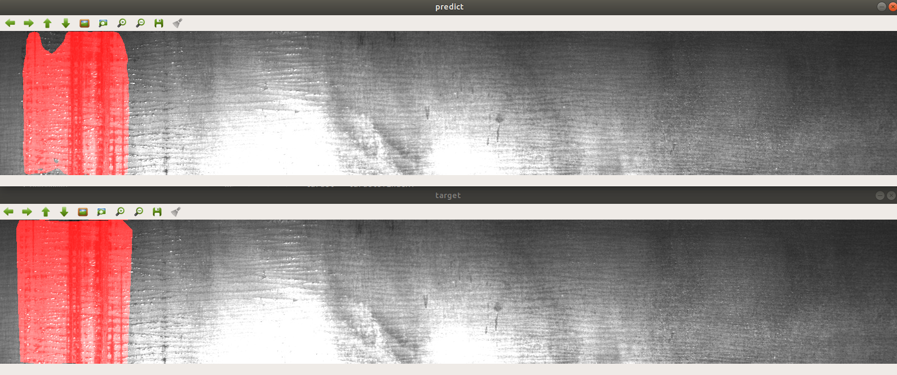
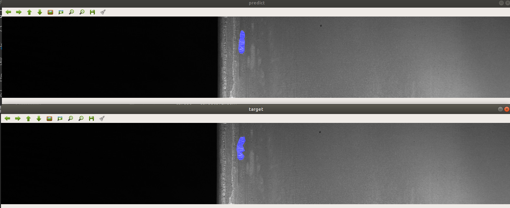

# Severstal: Steel Defect Detection



Code for Kaggle [Steel Defect Detection](https://www.kaggle.com/c/severstal-steel-defect-detection), 96th place solution (Top4%).

## Requirements
* Pytorch 1.2.0
* Torchvision 0.4.0
* pretrainedmodels 0.7.4
* efficientnet-pytorch 0.4.0
* Python3.7
* Install image augumentation library [albumentations](https://github.com/albu/albumentations)
```
conda install -c conda-forge imgaug
conda install albumentations -c albumentations
```
* Install [TensorBoard for Pytorch](https://pytorch.org/docs/stable/tensorboard.html)
```
pip install tb-nightly
pip install future
```
* Install [segmentation_models.pytorch](https://github.com/qubvel/segmentation_models.pytorch), using 0.0.3
```
pip install git+https://github.com/qubvel/segmentation_models.pytorch
```

If you encountered error like: `ValueError: Duplicate plugins for name projector` when you are evacuating `tensorboard --logdir=checkpoints/unet_resnet34`, please refer to: [this](https://github.com/pytorch/pytorch/issues/22676).

```
I downloaded a test script from https://raw.githubusercontent.com/tensorflow/tensorboard/master/tensorboard/tools/diagnose_tensorboard.py
I run it and it told me that I have two tensorboards with a different version. Also, it told me how to fix it.
I followed its instructions and I can make my tensorboard work.

I think this error means that you have two tensorboards installed so the plugin will be duplicated. Another method would be helpful that is to reinstall the python environment using conda.
```

## Segmentation Results

The followings are some visualizations of our results. There are two parts in the image above. The upper part is our segmentation mask, the lower part is the original mask.

**Example 1:**



**Example2:**



## How to run

### Clone Our Project

```bash
git clone https://github.com/zdaiot/Kaggle-Steel-Defect-Detection.git
cd Kaggle-Steel-Defect-Detection
```

### Prepare Dataset

Download steel datasets from [here](https://www.kaggle.com/c/severstal-steel-defect-detection/data) , unzip and put them into `../Input` directory.  

Structure of the `../Input` folder can be like:

```
test_images
train_images
sample_submission.csv
train.csv
```

Create soft links of datasets in the following directories:

```bash
cd Kaggle-Steel-Defect-Detection/datasets/Steel_data
ln -s ../../../Input/test_images ./
ln -s ../../../Input/train_images ./
ln -s ../../../Input/train.csv ./
ln -s ../../../Input/sample_submission.csv ./
```

### Train

#### Unet_ResNet34

**First,** you need to train a classification model:

```bash
python train_classify.py --model_name=unet_resnet34 --batch_size=48 --lr=0.0005 --epoch=30
```

After training, the Weight files will save at `checkpoints/unet_resnet34`。

**Second,** you need to train a segmentation model:

```bash
python train_segment.py --model_name=unet_resnet34 --batch_size=16 --lr=0.00004 --epoch=70
```

After training, the Weight files will save at `checkpoints/unet_resnet34`。

**Last,** you need to choose the best threshold and minimum connected domain for segmentation model:

```bash
python choose_thre_area.py --model_name=unet_resnet34 --batch_size=16 
```

The best threshold and minimum connected domain will be saved at  `checkpoints/unet_resnet34`。

#### Unet_ResNet50

**First,** you need to train a classification model:

```bash
python train_classify.py --model_name=unet_resnet50 --batch_size=24 --lr=0.00005 --epoch=30
```

After training, the Weight files will save at `checkpoints/unet_resnet50`。

**Second,** you need to train a segmentation model:

```bash
python train_segment.py --model_name=unet_resnet50 --batch_size=18 --lr=0.00005 --epoch=65
```

After training, the Weight files will save at `checkpoints/unet_resnet50`。

**Last,** you need to choose the best threshold and minimum connected domain for segmentation model:

```bash
python choose_thre_area.py --model_name=unet_resnet50 --batch_size=18
```

The best threshold and minimum connected domain will be saved at  `checkpoints/unet_resnet50`。

#### Unet_se_resnext50_32x4d

**First,** you need to train a classification model:

```bash
python train_classify.py --model_name=unet_se_resnext50_32x4d --batch_size=8 --lr=0.0004 --epoch=40
```

After training, the Weight files will save at `checkpoints/unet_se_resnext50_32x4d`。

**Second,** you need to train a segmentation model:

```bash
python train_segment.py --model_name=unet_se_resnext50_32x4d --batch_size=12 --lr=0.00004 --epoch=50
```

After training, the Weight files will save at `checkpoints/unet_se_resnext50_32x4d`。

**Last,** you need to choose the best threshold and minimum connected domain for segmentation model:

```bash
python choose_thre_area.py --model_name=unet_se_resnext50_32x4d --batch_size=12
```

The best threshold and minimum connected domain will be saved at  `checkpoints/se_resnext50_32x4d`。

### Tensorboard

After the training of model, we can use tensorboard to analyze the training curves. For example

```bash
cd checkpoints/unet_resnet34
tensorboard --logdir=./
```

### Create Prediction csv

```
python create_submission.py
```

After running the code, submission.csv will be generated in the root directory, which is the result predicted by the model.

**Note:** If you want to integrate different models using average strategy , please run this:

```bash
python utils/cal_thre_area_mean.py
```

## Demo

When you have trained and selected the threshold and minimum connected domain, you can use `demo.py` to visualize the performance on the validation set

```bash
python demo.py
```

When the program is running, press the space bar to get the next test result.

**Note:** It is important to note that this code is only suitable for testing the performance of the signal fold, for complete cross-validation, there is no handout datasets, so using this code can not measure the generalization ability of the model.

## Submit to kernel

This is a Kernels-only competition, I wrote a script to facilitate submitting code and weight files to kernel.

First, Install [Kaggle API](https://github.com/Kaggle/kaggle-api): `pip install kaggle`

To use the Kaggle API, sign up for a Kaggle account at https://www.kaggle.com. Then go to the 'Account' tab of your user profile (https://www.kaggle.com/<username>/account) and select 'Create API Token'. This will trigger the download of kaggle.json, a file containing your API credentials. Place this file in the location ~/.kaggle/kaggle.json

For your security, ensure that other users of your computer do not have read access to your credentials. On Unix-based systems you can do this with the following command:

```bash
chmod 600 ~/.kaggle/kaggle.json
```

When you first submit to kernel, you need to run

```bash
./uploads.sh 0
```

Then, you can open  `https://www.kaggle.com/<username>/severstal-submission` in your browser. Change `kaggle = 0`  to `kaggle = 1` in the kernel file and you can run the kernel.

If you want to update script files and kernel files, you need to run

```bash
./uploads.sh 1
```

If you want to update script files, kernel files, and weight files, you need to run

```bash
./uploads.sh 2
```

**Note:** For some reason, I have to use VPN to access kaggle fluently. So I also added a terminal agent to the script.

## Online submission of local csv file

Please see [this](https://www.kaggle.com/c/severstal-steel-defect-detection/discussion/108638#latest-628715) for detailed information

First, Install [Kaggle API](https://github.com/Kaggle/kaggle-api): `pip install kaggle`

To use the Kaggle API, sign up for a Kaggle account at https://www.kaggle.com. Then go to the 'Account' tab of your user profile (https://www.kaggle.com/<username>/account) and select 'Create API Token'. This will trigger the download of kaggle.json, a file containing your API credentials. Place this file in the location ~/.kaggle/kaggle.json

For your security, ensure that other users of your computer do not have read access to your credentials. On Unix-based systems you can do this with the following command:

```bash
chmod 600 ~/.kaggle/kaggle.json
```

Clone the repo: `git clone https://github.com/alekseynp/kaggle-dev-ops.git`
Enter the repo: `cd kaggle-dev-ops`
Go to severstal: `cd severstal-steel-defect-detection`
Initialize: `make init-csv-submission`
Submit: `SUBMISSION=/path/to/csv/file.csv make release-csv`
Click the link to the kernel and press the submit to competition button.

When run `SUBMISSION=/path/to/csv/file.csv make release-csv`, If you encounter the following erro: `Invalid dataset specification /severstal_csv_submission`. You should manually edit the `kernel-csv-metadata.json` and add your username here:
"dataset_sources": ["YOUR_KAGGLE_USERNAME_HERE/severstal_csv_submission"],

**Please notice that:** Any submission made with this tool will score zero on the final private LB. The point of the tool is to make it easy to quickly submit CSVs created locally for the public test set and get a public LB score.

## TODO

- [x] finish classify + segment model
- [x] finish create_submission.py 
- [x] finish demo.py
- [x] finish loss.py
- [x] finish choose_threshold
- [x] finish data augmentation
- [x] EfficientB4( w/ ASPP)
- [x] code review(validation dice, threshold dice)
- [x] train segmentation model only on masked datasets
- [x] choose fold
- [x] TTA
- [x] ensemble
