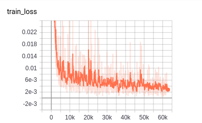
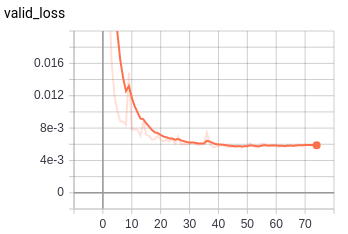
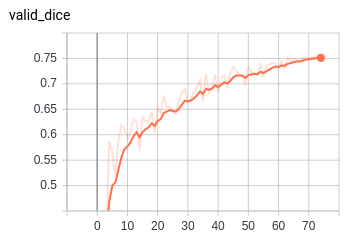
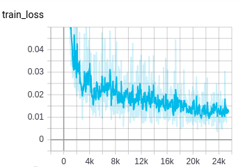
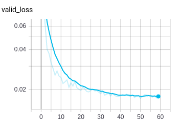
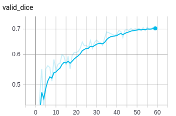
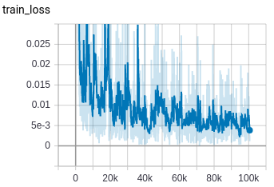
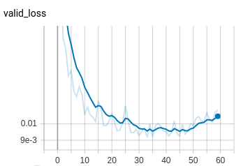
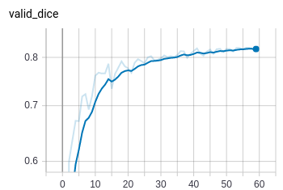

# 钢铁损伤检测试验记录

## 分割模型使用加权BCE+DICE损失

### 学习率：4e-4，Epoch: 70

#### 训练曲线

* 训练集损失曲线

  

  如上图所示，研究曲线后发现，模型在训练前期过早收敛，后期收敛缓慢，因而认为学习率可能过大。

* 验证集损失曲线和dice曲线

  

  

  观察损失曲线和dice曲线，可以发现：

  * 学习率有点高
  * 验证集的指标仍在上升

#### LB

0.89005

#### 改进策略

设备：LZD

1.  降低学习率，1e-4
2. 多跑几个epoch，75

## 只使用有掩膜的样本训练分割模型，不加载分类权重

### 学习率：4e-4，Epoch：60

#### 训练曲线

* 训练集损失曲线

  

  训练前期，曲线下降过快，后期缓慢，掉入局部最小点。

* 验证集损失曲线和Dice曲线

  

  

  验证集曲线比较正常。

#### LB

0.90092

#### 改进策略

设备：MXQ

1. 降低学习率，1e-4
2. 增加训练epoch，70 epoch

## unet_se_renext50

### 学习率：4e-4，Epoch：60

#### 训练曲线

* 训练集损失曲线

  

  由于batch_size比较小的原因，模型的训练损失曲线很震荡，同时也有点过早收敛。

* 验证集损失曲线和Dice曲线

  

  

  观察验证集的损失曲线，很容易发现发生了过拟合现象。

#### LB 

* TTA: 0.90268
* w/ TTA：0.90222

### 改进策略

设备：HWP

需要解决batch_size过小和过拟合问题。

* batch_size

  * 使用GN（分组归一化）
  * 用MXQ的设备

* 过拟合

  * 早停，45个epoch
  * 权重衰减，5e-4

* 稍微降低学习率

  4e-4 -> 4e-5

